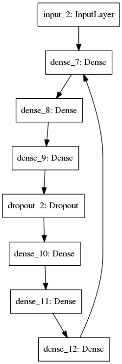

# Training Deep AutoEncoders for Collaborative Filtering
An implementation of the research described in: "Training Deep AutoEncoders for Collaborative Filtering" (https://arxiv.org/abs/1708.01715) in Tensorflow & Keras

### The Model
The model is based on deep AutoEncoders.



## Requirements
Please install the following on a linux or windows-based machine, instructions for setup in Ubuntu are given below.
* Python 3.6
* Tensorflow 1.11.0
* CUDA 9.0
* Numpy(>=1.15.0)
* Pandas(>=0.23.0)
* Jupyter(>=1.0.0)

## Getting Started

### Environment Setup
Python 3.6 Installation
```
$ sudo apt-get update
$ sudo apt-get install python3-dev python3-pip
```
Pip & related libraries
```
$ pip3 install -r requirements.txt
$ pip3 install --user --upgrade tensorflow
```
Tensorflow may require Virtualenv, if the above process fails please see detaile instructions [here](https://www.tensorflow.org/install/pip).

### Launch Jupyter Notebook & Tensorboard
Go to the project directory and run the following commands:
```
$ jupyter notebook
```
In browser, open http://localhost:8888/
In another terminal window:
```
$ tensorboard --logdir==./logs
```
In browser, open http://localhost:6006

### Get the data

**Note: The following are not required to run the code demo, might only be downloaded to run original architechure. Skip this step, files for demo are already preprocessed and included for convenience.**
Download from [here](http://academictorrents.com/details/9b13183dc4d60676b773c9e2cd6de5e5542cee9a) into your ```DeepRecommender``` folder
```
$ tar -xvf nf_prize_dataset.tar.gz
$ tar -xf download/training_set.tar
$ python ./netflix_data_convert.py training_set nf_data
```

### Run the Code
* Open the file `Functional Model.ipynb` in Jupyter Notebook
* Restrart the kernel and clear all output.
* Follow the steps in the Jupyter Notebook, executing the code snippets in order.
* Check the results and plots in tensorboard.

## Note
The actual dataset is not used in this demo, becuase of lack of computation power at user end. The original dataset is large and forms a `311315 x 17736` user-movie matrix which cannot be processed on regular laptops. 
We have reduced the dataset to `13118 x 1000` using a fator `k=(17736/1000)` for demo purposes, though this produces more error due to lesser size of training data. The layer sizes have also been reduced proportionately to display the autoencoder functionality.
Higher layer sizes perform better but it doesn't depict the purpose of autoencoders to compress data.
The original dataset can be used to produce more accurate results but would require huge computation power and memory and time to process.

## Results
It should be possible to achieve the following results. 
(exact numbers will vary due to randomization)

| Dataset | RMSE | 
| -------- | ---------------- |
| Train | 0.8580 |
| Validation | 1.6281 |
| Test | 1.5679 |